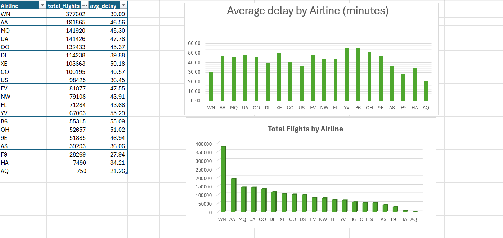

## Airline Delay Analysis (SQL • Excel • Power BI)

## Project Overview
This project analyzes airline flight delay data to identify patterns in airline performance, airport congestion, and delay causes.
The analysis was conducted using SQL for data exploration, and the results are later visualized in Excel and Power BI.

Dataset contains ~1.9 million flight records including flight times, delays, airline codes, airports, and delay causes.

## SQL-based analysis of airline delay data to identify operational patterns and delay causes.

## Tools Used
- PostgreSQL – Database engine
- Beekeeper Studio – SQL client for querying and analysis

## Key Insights
- 20 airlines were identified in the dataset.
- Airlines YV and B6 showed the highest average delays (~55 minutes).
- Average departure delay (~43 min) and arrival delay (~42 min) were similar.
- Late aircraft delay was the largest contributor to overall delays.
- Weather and security delays had relatively smaller

  ## Excel Visualization

### Insights

• Airlines YV and B6 have the highest average delays (~55 minutes).

• WN operates the largest number of flights (~377k) but maintains lower average delays (~30 minutes).

• Several airlines cluster between 40–50 minutes average delay.

• Some airlines operate very few flights (e.g., AQ), making comparisons less statistically reliable.
