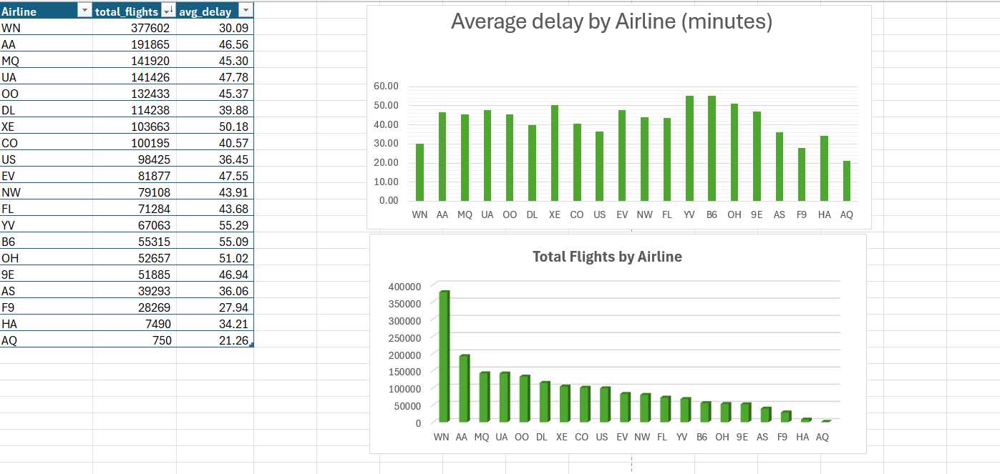

#  Airline Delay Analysis — SQL, Excel & Power BI

 Not just knowing that flights are delayed — but understanding **which carriers experience longer delays, whether flight volume is related to delay, and what the data actually tells us about airline operations.**

This project is an end-to-end analysis of approximately **1.9 million U.S. flight records from 2008**, covering 20 airline carriers.

I used **Excel for data cleaning and validation, SQL for aggregation and analysis, and Power BI for interactive visualization.**

---

##  The Project

Flight delays affect passengers, schedules, and airline operations.

I wanted to move beyond simply looking at individual delayed flights and instead ask:

1. **Which airlines have the highest and lowest average delays?**
2. **Does flight volume relate to average delay time?**
3. **What patterns appear when comparing airlines across both volume and delay performance?**

The goal was to turn a large flight-level dataset into a small set of meaningful operational insights.

---

##  The Data

The analysis uses 2008 U.S. airline on-time performance data containing approximately **1.9 million flight records** across 20 carriers.

The dataset contains information such as:

- Airline / carrier
- Flight date
- Departure and arrival times
- Departure and arrival delays
- Origin and destination
- Distance
- Cancellation information
- Diversion information
- Different delay causes

The underlying data comes from the **U.S. Department of Transportation's Bureau of Transportation Statistics (BTS)**. 

---

# How I Approached the Analysis

I wanted the project to follow a realistic analytics workflow rather than simply producing a chart.

### 1. Clean

I started by preparing the flight-level data and checking the fields required for analysis.

**Tool:** Excel

I used Excel to inspect the data, validate the fields, and prepare the dataset for analysis.

### 2. Query

Once the data was ready, I used SQL to aggregate millions of flight records into carrier-level metrics.

**Tool:** SQL

The main measures were:

- Total number of flights
- Average delay
- Airline-level comparisons

### 3. Visualise

I then turned the aggregated results into visual analysis.

**Tool:** Power BI

The goal was to make the differences between airlines easier to understand rather than leaving the results as a table of numbers.

### 4. Validate

Finally, I used Excel to cross-check the aggregated results and make sure the SQL outputs were consistent.

---

#  Excel Analysis

Before building the final visual analysis, I created a carrier-level summary containing:

- Total flights
- Average delay

This gave me the first view of how airline performance differed across the dataset.



The table and charts make two things immediately visible:

**flight volume and average delay do not move together in a simple way.**

The busiest carrier in the analysis has one of the lower average delays, while several carriers with substantially fewer flights show higher average delays.

That became one of the most interesting findings in the project.

---

#  SQL Approach

Instead of manually calculating carrier-level statistics, I used SQL aggregation to create a reusable summary.

```sql
SELECT
    UniqueCarrier,
    COUNT(*) AS total_flights,
    AVG(delay_col) AS avg_delay
FROM flights
GROUP BY UniqueCarrier
ORDER BY avg_delay DESC;
